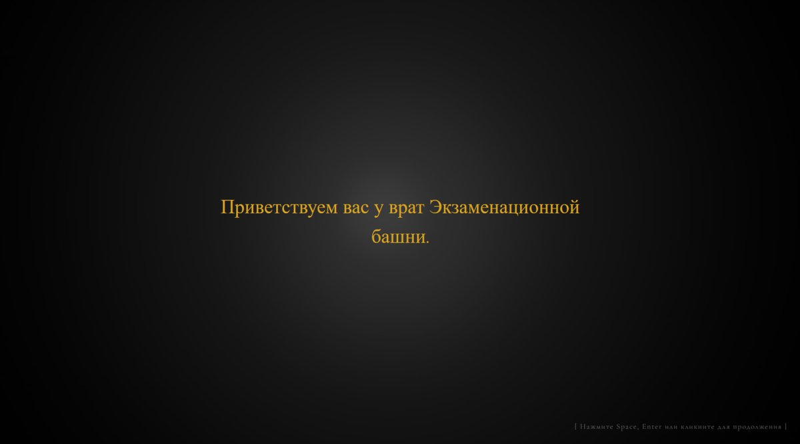
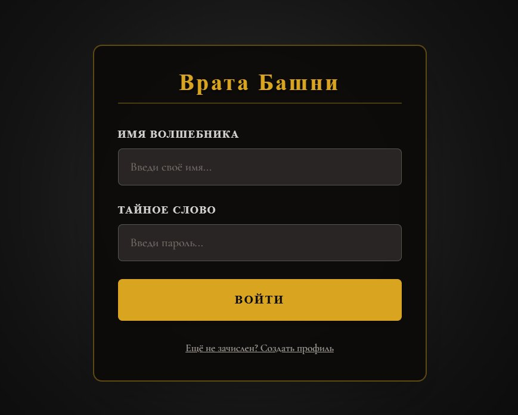
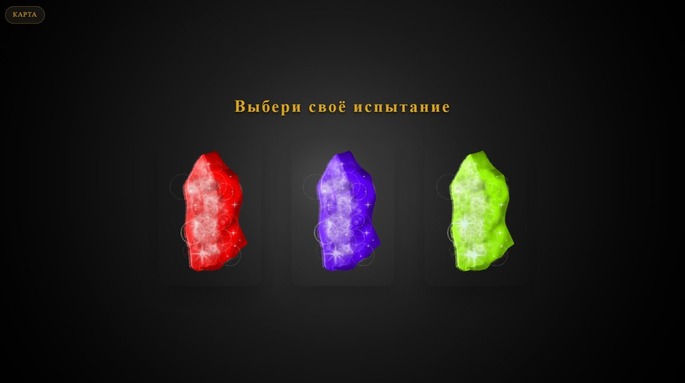
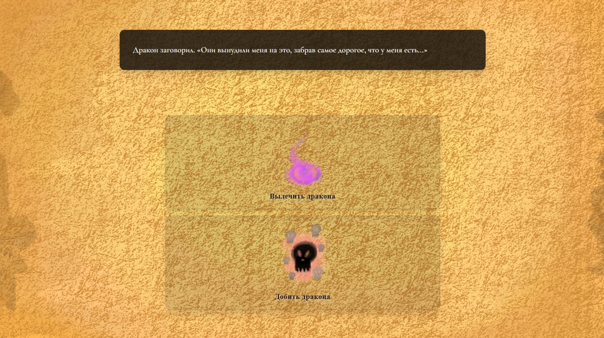
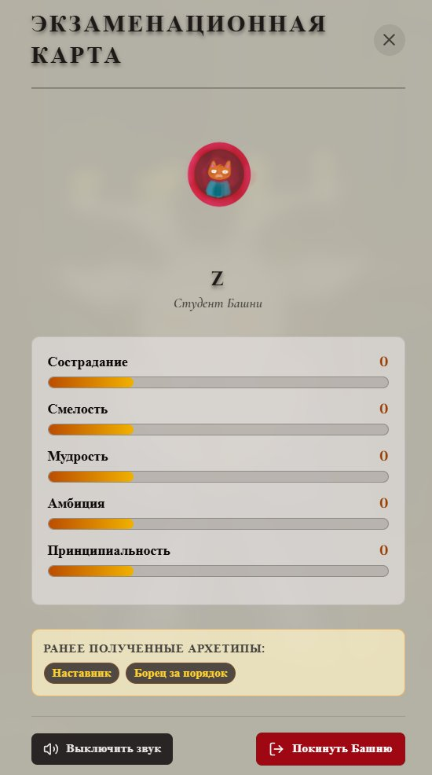
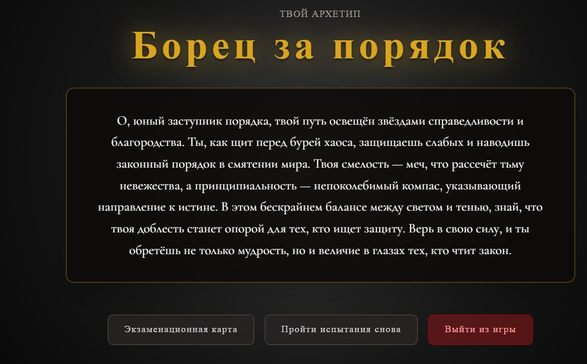
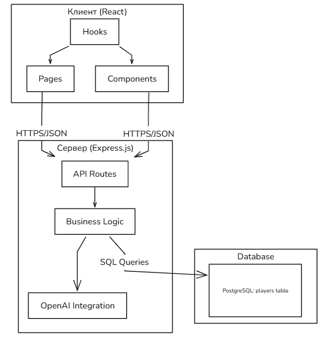
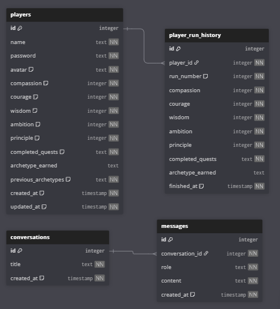
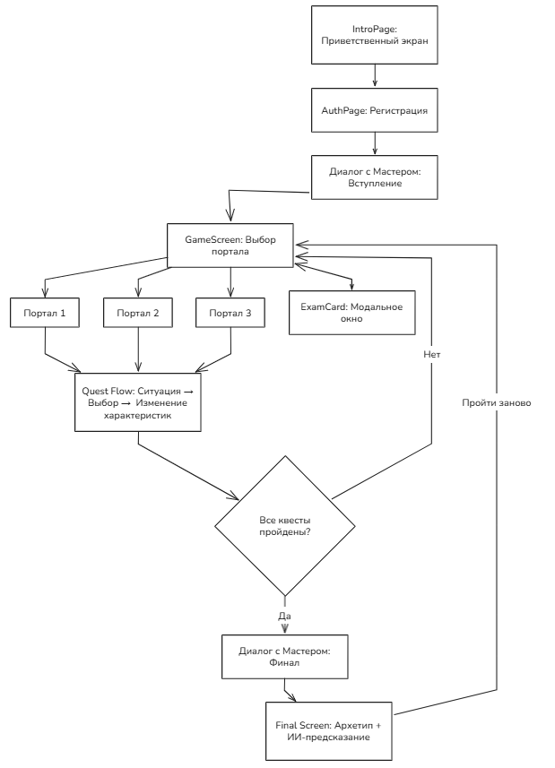

# «Путь Волшебника» — интерактивный квест с моральным профилированием и адаптивным финалом

Дипломный проект (ВКР) по специальности 09.02.07 «Информационные системы и программирование», Колледж телекоммуникаций МТУСИ, 2026. Оценка — 5.

> ▶ **Играбельное демо (без сервера):** https://milana-solodovnik.github.io/put-volshebnika/
> В демо-режиме данные игрока хранятся в вашем браузере (localStorage), предсказания — из заготовленной библиотеки текстов. Полная версия с генерацией через OpenAI API поднимается локально по инструкции ниже.

Full-stack веб-приложение: интерактивный квест, который на основе выборов пользователя рассчитывает многомерный «моральный профиль» персонажа и формирует индивидуальный финал и предсказание с помощью генеративной модели.

## Скриншоты

|  *Стартовый экран* |  *Регистрация и вход* |  *Выбор испытания* |
|---|---|---|
|  *Моральный выбор в квесте* |  *«Экзаменационная карта»: профиль персонажа* |  *Итог: архетип и предсказание* |

## Стек

| Слой | Технологии |
|------|-----------|
| Frontend | React, TypeScript, Vite, Tailwind CSS |
| Backend | Node.js, Express, REST API |
| База данных | PostgreSQL, Drizzle ORM (+ хранимые функции, PL/pgSQL) |
| Инфраструктура | pnpm (монорепозиторий), Git |
| Интеграции | OpenAI API (генерация контента) |

## Возможности

- Прохождение квестовых сценариев с ветвлением и системой характеристик персонажа.
- Адаптивный финал: результат зависит от накопленного «морального профиля».
- Генерация уникального текстового предсказания через OpenAI.
- Регистрация/аутентификация пользователей, сохранение прогресса и истории прохождений.
- Компонентный интерфейс с анимациями и адаптивной вёрсткой.

## Архитектура

Клиент-серверное приложение с разделением слоёв представления, бизнес-логики и данных:

- Клиент — React + TypeScript, компонентный подход, адаптивная вёрстка (Tailwind CSS).
- Сервер — Node.js + Express: REST API, аутентификация, серверная валидация входных данных, расчёт игровых параметров.
- Данные — PostgreSQL: логическая и физическая модель, ER-диаграмма, нормализация. Часть прикладной логики вынесена на уровень СУБД (хранимые функции) для надёжности и атомарности операций.

Основные сущности: Игрок (Player), Квест (Quest), Выбор (Choice), Архетип (Archetype).

| Слои приложения | Модель данных (Drizzle ORM) |
|---|---|
|  |  |

Сценарий прохождения (схема экранов):

## Безопасность

- Хеширование паролей (bcrypt).
- Защита от SQL-инъекций — параметризованные запросы.
- Валидация всех входных данных на стороне сервера.
- Работа по HTTPS.

## Запуск (локально)

pnpm install — установка зависимостей; заполнить переменные окружения (.env); pnpm dev — запуск в режиме разработки.

Переменные окружения (OpenAI API-ключ, строка подключения к PostgreSQL и т.д.) задаются через .env и в репозиторий не коммитятся.

## Автор

Милана Солодовник
